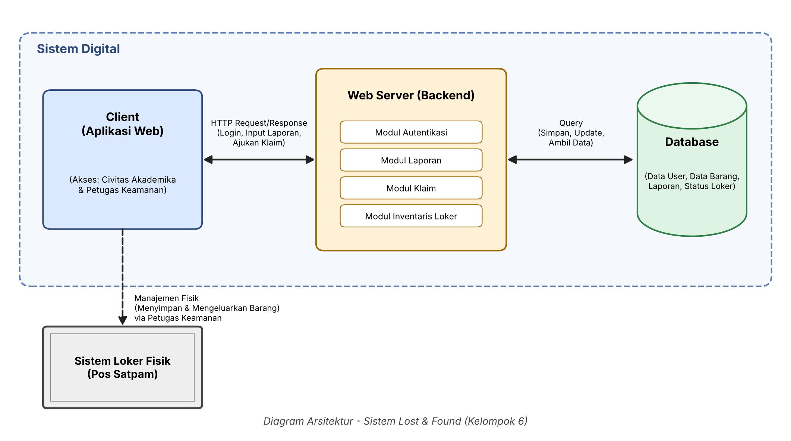

# Docs/Week 6 Design

**Mata Kuliah** : Rekayasa Perangkat Lunak  
**Kelompok**    : 6  
**Kelas**       : 3-D  
**Anggota**     :
- 1251420135 Faiz Abyakta Santoso [Ketua]
- 1251420098 Fandy Ahmad Fahrezy
- 1251420089 Muhammad Ghassan Dzul Hannan
- 1251420097 Yazid Dio Alamgir

---

## Project Kami
Proyek kami adalah **Sistem Web Lost & Found Kampus** yang dirancang untuk memusatkan informasi pencarian dan penemuan barang di lingkungan akademik. Inovasi utama dari proyek ini adalah integrasi langsung antara platform web digital dengan Sistem Loker Fisik yang ditempatkan di Pos Satpam, sehingga pengelolaan fisik barang menjadi lebih terstruktur dan aman. 
 
**Fitur Keunggulan:**
Menampilkan katalog barang hilang dan ditemukan agar pemilik barang bisa mencari dan menemukan barang yang hilang secara mudah.

---

## 1. Kebutuhan Terpilih dan Asumsi

### Kebutuhan Terpilih:
- Sistem berbasis web yang memiliki fitur autentikasi (daftar dan login) yang dibatasi hanya menggunakan email resmi kampus. 
- Fitur pelaporan dua arah dengan mengisi formulir untuk barang yang hilang dan barang yang ditemukan. 
- Fitur katalog barang yang terintegrasi dengan filter pencarian dan opsi untuk membagikan informasi.
- Fitur pengajuan klaim barang yang mewajibkan pengguna mengunggah bukti kepemilikan untuk divalidasi oleh petugas. 
- Sistem manajemen tempat loker khusus untuk Petugas Keamanan (Satpam) untuk mengatur penempatan dan pengeluaran barang secara fisik. 

### Asumsi:
- Seluruh target pengguna (Civitas Akademika) aktif menggunakan email kampus mereka untuk proses verifikasi. 
- Pihak kampus atau pos satpam memiliki fasilitas loker fisik yang memadai untuk menampung barang temuan. 
- Pengguna memiliki perangkat (smartphone/laptop) dengan kamera atau galeri untuk mengambil dan mengunggah foto sebagai bukti kepemilikan barang. 

---

## 2. Daftar Modul dan Tanggung Jawab

### Modul Autentikasi
Bertanggung jawab menangani proses pendaftaran akun, verifikasi domain email kampus, dan sesi login pengguna. 

### Modul Manajemen Laporan (Katalog)
Bertanggung jawab memproses input formulir barang hilang/temuan, menyimpan data ke basis data, dan menampilkannya di halaman antarmuka katalog beserta fungsi filternya.

### Modul Validasi & Klaim
Bertanggung jawab mengelola permintaan pengajuan klaim dari pengguna, menyimpan unggahan bukti kepemilikan, dan menyediakan antarmuka bagi Petugas Keamanan untuk menyetujui atau menolak klaim tersebut.

### Modul Inventaris Loker (Admin Satpam)
Bertanggung jawab mencatat pemetaan barang ke dalam nomor loker fisik tertentu dan memperbarui status ketersediaan loker setelah barang diambil oleh pemiliknya.

---

## 3. Diagram Arsitektur dan Label Hubungan

---

## 4. Alur Satu Fitur, Termasuk Satu Kondisi Gagal

### Fitur: Mengklaim Barang

**Alur Sukses:**
1. Mahasiswa melihat barang miliknya di katalog barang hilang dan menekan tombol “Klaim Barang”.
2. Sistem meminta mahasiswa mengunggah foto bukti kepemilikan (misal: nota pembelian atau foto lama bersama barang).
3. Bukti terunggah, status barang berubah menjadi “Menunggu Validasi”.
4. Petugas keamanan mengecek bukti di sistem dan menekan tombol “Setuju”.
5. Mahasiswa datang ke pos barang hilang dan menunjukkan identitas.
6. Petugas keamanan menyerahkan barang dari loker dan menekan “Konfirmasi Penjemputan” di sistem. Status selesai.

**Kondisi Gagal:**
1. Mahasiswa menekan tombol “Klaim Barang” dan mengunggah bukti kepemilikan.
2. Petugas keamanan mengecek bukti, namun foto yang diunggah buram atau tidak membuktikan kepemilikan secara meyakinkan.
3. Petugas keamanan menekan tombol “Tolak” dan memasukkan alasan penolakan.
4. Sistem mengirim notifikasi penolakan kepada mahasiswa.
5. Status klaim digagalkan dan barang kembali tersedia di katalog untuk diklaim pihak lain yang lebih berhak.

---

## 5. Dua Keputusan Desain Beserta Alasannya

### Keputusan 1: Pendaftaran Akun Dibatasi Hanya Menggunakan Email Kampus
**Alasan:** Keputusan ini diambil untuk alasan keamanan dan validasi identitas otomatis. Dengan membatasi pendaftaran hanya pada domain email kampus (misalnya `@mhs.kampus.ac.id`), sistem memastikan bahwa hanya pihak internal yang berhak menggunakan layanan ini, meminimalisir risiko penipuan atau pencurian barang oleh pihak luar kampus. 

### Keputusan 2: Penyatuan Titik Serah-Terima di Pos Satpam (Integrasi Inventaris Loker)
**Alasan:** Daripada mempertemukan penemu dan pencari barang secara langsung yang berisiko bentrok jadwal atau keamanan, diputuskan bahwa semua barang temuan diserahkan ke satu titik terpusat yaitu Pos Satpam. Satpam memiliki otoritas, selalu siaga 24 jam, dan memiliki fasilitas loker fisik, sehingga keamanan barang lebih terjamin dan proses pengambilan lebih terstruktur.